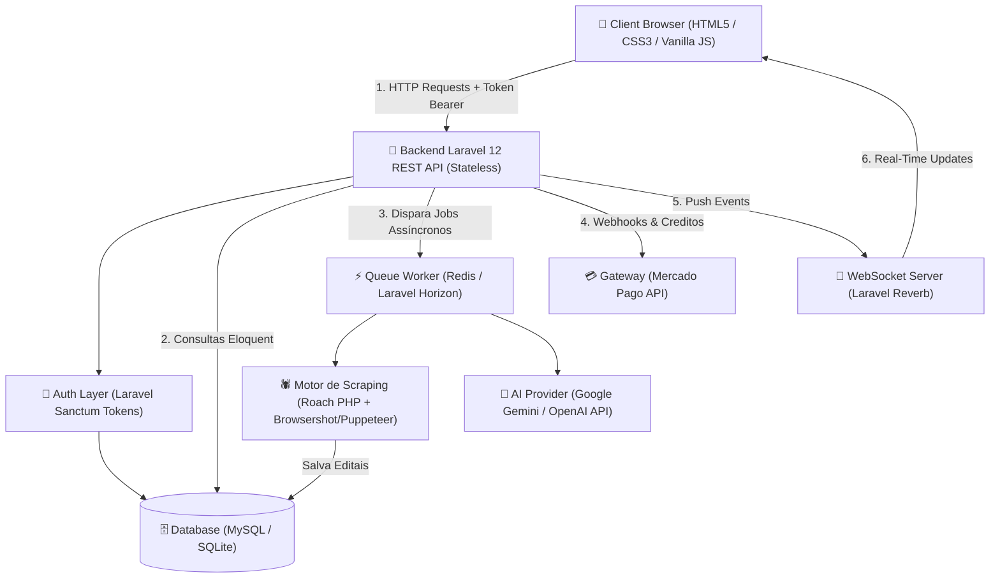
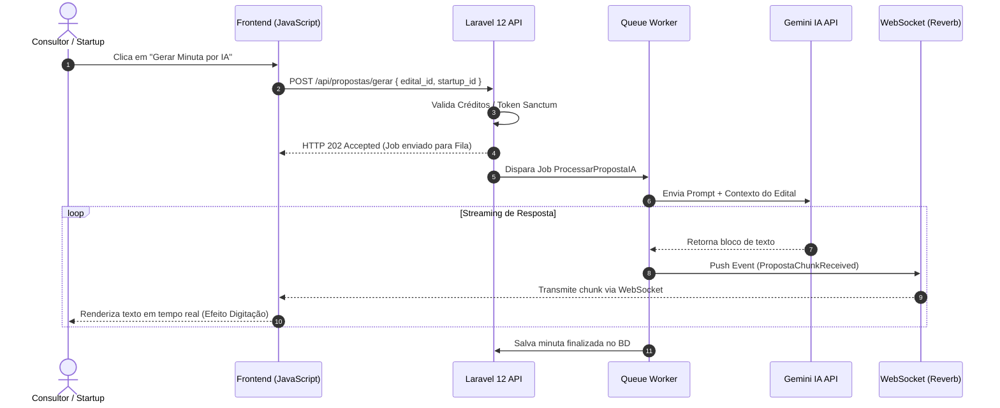
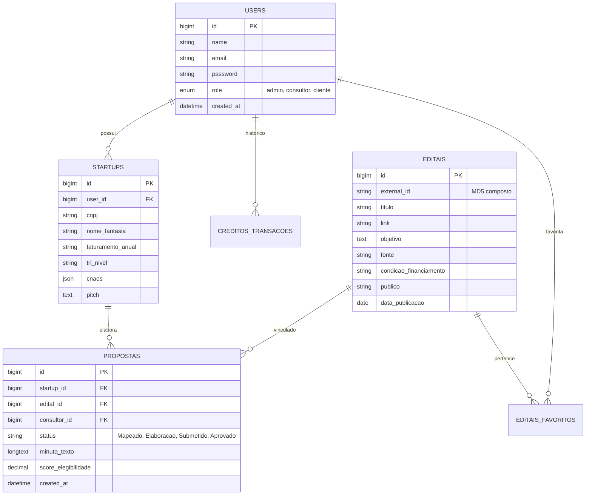

# 🏛️ Guia de Artefatos e Decisões Arquiteturais (ADRs & Padrões)

Este documento define os **Artefatos Técnicos e Arquiteturais** do projeto **Radar de Editais B2B**, detalhando as justificativas de engenharia de software (o "porquê" das escolhas), os contratos de integração da API Stateless e os padrões de código que orientam a equipe e sustentam a defesa técnica perante a banca examinadora (UniCesumar).

---

## 📌 Sumário de Artefatos

1. [Registros de Decisões Arquiteturais (ADRs)](#1-registros-de-decisões-arquiteturais-adrs)
2. [Especificação do Contrato de API (REST Stateless)](#2-especificação-do-contrato-de-api-rest-stateless)
3. [Diagramas de Arquitetura e Sequência (Mermaid.js)](#3-diagramas-de-arquitetura-e-sequência-mermaidjs)
4. [Modelo de Dados e Diagrama Entidade-Relacionamento (DER)](#4-modelo-de-dados-e-diagrama-entidade-relacionamento-der)
5. [Guia de Padrões de Código e Golden Template](#5-guia-de-padrões-de-código-e-golden-template)

---

## 1. Registros de Decisões Arquiteturais (ADRs)

Os **Architecture Decision Records (ADRs)** registram as justificativas técnicas das escolhas do sistema.

### 📝 ADR-01: Adoção de Arquitetura API REST Stateless (Laravel Sanctum)
* **Status:** Aprovado.
* **Contexto:** A equipe necessita desenvolver o sistema dividindo o Frontend (HTML5/CSS3/JavaScript) do Backend (Laravel 12), permitindo desenvolvimento desacoplado e em paralelo.
* **Decisão:** Utilizar a arquitetura **Stateless (sem sessão baseada em cookies no servidor)** onde o servidor responde estritamente dados JSON e a autenticação ocorre via **Tokens Bearer** com **Laravel Sanctum**.
* **Justificativa/Consequências:** 
  * Elimina dependência de estado no servidor, melhorando escalabilidade.
  * Permite que os alunos do Frontend trabalhem de forma independente consumindo dados mockados via Postman.
  * Prepara o Backend para consumo futuro por aplicações mobile (iOS/Android/React Native).

---

### 📝 ADR-02: Raspagem Dinâmica com Roach PHP + Browsershot (Puppeteer)
* **Status:** Aprovado.
* **Contexto:** Portais corporativos de fomento (como a FINEP baseada em Liferay) utilizam paginação dinâmico em AJAX (Single Page Application). Requisições HTTP tradicionais via `cURL` retornam dados incompletos ou nulos.
* **Decisão:** Integrar o framework **Roach PHP** com a biblioteca **Spatie Browsershot**, instanciando um Chromium headless (Node.js/Puppeteer) que injeta scripts assíncronos e acumula os nós HTML em um "Cofre Virtual" V8.
* **Justificativa/Consequências:**
  * Garante 100% de captura dos dados ricos de oportunidades.
  * Reduz o tempo de extração de ~30 minutos para 1-2 minutos de forma totalmente idempotente (gerando chave `external_id` via MD5 composto).

---

### 📝 ADR-03: Comunicação em Tempo Real via Laravel Reverb (WebSockets)
* **Status:** Aprovado.
* **Contexto:** A geração de minutas de propostas por IA e a leitura de PDFs pesados são processos assíncronos longos. Manter requisições HTTP abertas gera timeouts e má experiência do usuário.
* **Decisão:** Integrar o **Laravel Reverb** (servidor WebSocket nativo) consumido pelo **Laravel Echo** no JavaScript do cliente.
* **Justificativa/Consequências:**
  * Permite streaming de texto em tempo real (efeito digitação ao vivo da IA - `RF-44`).
  * Atualiza instantaneamente a posição de cards no painel Kanban colaborativo entre consultores (`RF-45`).
  * Notifica a conclusão de tarefas em segundo plano sem necessidade de F5 (`RF-46`).

---

### 📝 ADR-04: Processamento Assíncrono de Regulamentos em PDF via Queues & Redis
* **Status:** Aprovado.
* **Contexto:** A leitura e extração de regras de arquivos PDF de editais de 50+ páginas consumiria muito tempo e estouraria o limite da requisição HTTP (`max_execution_time`).
* **Decisão:** Delegar o processamento pesado de arquivos PDF para tarefas em segundo plano gerenciadas por **Laravel Queues / Redis**.
* **Justificativa/Consequências:**
  * A resposta HTTP é imediata (`202 Accepted`), mantendo a interface rápida e responsiva.
  * O resultado é notificado ao usuário via WebSocket assim que o processamento na fila é finalizado.

---

## 2. Especificação do Contrato de API (REST Stateless)

Para garantir a integração entre os alunos do Frontend e do Backend, todas as respostas da API seguem um **padrão estrutural estrito em JSON**:

### 🟢 Padrão de Resposta de Sucesso (`200 OK` / `201 Created`):
```json
{
  "success": true,
  "data": {
    "id": 1,
    "titulo": "Chamada Pública FINEP - Subvenção Econômica",
    "fonte": "FINEP",
    "condicao_financiamento": "Não reembolsável"
  },
  "message": "Operação realizada com sucesso."
}
```

### 🔴 Padrão de Resposta de Erro de Validação (`422 Unprocessable Entity`):
```json
{
  "success": false,
  "message": "Dados inválidos fornecidos.",
  "errors": {
    "email": [
      "O campo e-mail é obrigatório.",
      "O e-mail informado já está em uso."
    ]
  }
}
```

---

## 3. Diagramas de Arquitetura e Sequência (Mermaid.js)

### 🏗️ Diagrama de Visão Geral de Arquitetura (Contêineres C4)



---

### 🔄 Diagrama de Sequência: Geração de Minuta com IA e WebSockets



---

## 4. Modelo de Dados e Diagrama Entidade-Relacionamento (DER)



---

## 5. Guia de Padrões de Código e Golden Template

Para garantir legibilidade no código e facilitar a arguição na banca, a equipe segue as seguintes **convenções de padronização**:

* **PSR-12 (PHP):** Classes em `PascalCase`, métodos em `camelCase`, propriedades em `camelCase`.
* **Banco de Dados & JSON:** Tabela no plural (`editais`), chaves estrangeiras em `singular_id`, campos em `snake_case` (`data_publicacao`).
* **JavaScript:** Variáveis em `camelCase`, funções assíncronas declaradas explicitamente com `async/await`.

### 💡 O "Golden Template" (Código Molde Didático)

Este é o padrão de referência que todos os integrantes utilizam como base para implementar seus respectivos módulos:

#### 1. Rota REST (`routes/api.php`):
```php
use App\Http\Controllers\EditalController;

Route::middleware('auth:sanctum')->group(function () {
    Route::get('/editais', [EditalController::class, 'index']);
    Route::get('/editais/{id}', [EditalController::class, 'show']);
});
```

#### 2. Controller Laravel (`app/Http/Controllers/EditalController.php`):
```php
namespace App\Http\Controllers;

use App\Models\Edital;
use Illuminate\Http\JsonResponse;
use Illuminate\Http\Request;

class EditalController extends Controller
{
    public function index(Request $request): JsonResponse
    {
        $query = Edital::query();

        if ($request->filled('search')) {
            $query->where('titulo', 'like', '%' . $request->search . '%');
        }

        $editais = $query->latest('data_publicacao')->paginate(12);

        return response()->json([
            'success' => true,
            'data' => $editais,
            'message' => 'Editais recuperados com sucesso.'
        ], 200);
    }
}
```

#### 3. Consumo no Frontend JavaScript (`public/js/editais.js`):
```javascript
async function carregarEditais(termoBusca = '') {
    const token = localStorage.getItem('auth_token');

    try {
        const response = await fetch(`/api/editais?search=${termoBusca}`, {
            method: 'GET',
            headers: {
                'Content-Type': 'application/json',
                'Authorization': `Bearer ${token}`
            }
        });

        const resultado = await response.json();

        if (resultado.success) {
            renderizarCards(resultado.data.data);
        } else {
            console.error('Erro:', resultado.message);
        }
    } catch (erro) {
        console.error('Falha na requisição:', erro);
    }
}
```
