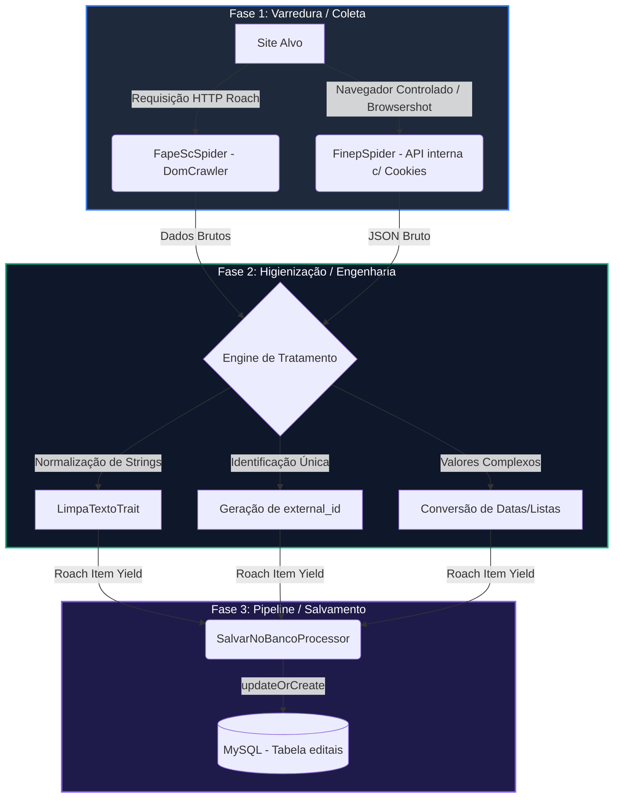

# 🕷️ Ciclo Completo (Full Cycle): Varredura, Tratamento e Persistência de Dados com Roach PHP

Este guia descreve de forma didática e profunda o fluxo completo de **extração (scraping)**, **higienização/tratamento (refinamento)** e **persistência (idempotência)** de dados deste projeto, utilizando como estudos de caso práticos os spiders reais da **FAPESC** e da **FINEP**.

---

## 🏗️ Arquitetura Geral do Fluxo (Data Pipeline)

A jornada de um dado coletado segue uma esteira rigorosa de responsabilidades para garantir consistência, robustez e performance:



---

## 🔍 Fase 1: Varredura (A Coleta de Dados)

Dependendo do comportamento do site-alvo, utilizamos duas abordagens de coleta distintas:

### 1. Coleta Estática do DOM (Abordagem Simples)
**Estudo de Caso:** `FapeScSpider`
*   **Quando usar:** Quando a URL muda claramente ao paginar e os dados são renderizados diretamente no HTML enviado pelo servidor (Server-Side Rendering).
*   **Como funciona:** O Roach PHP faz uma requisição HTTP simples e rápida à página. Em seguida, utilizamos o componente `DomCrawler` da Symfony para fatiar o DOM usando seletores CSS convencionais.
*   **Vantagem:** Consumo de memória extremamente baixo e alta velocidade de varredura.

```php
// FapeScSpider.php - Fatiamento do HTML
$cards = $response->filter('.upk-list-wrap .upk-item');

foreach ($cards as $node) {
    $card = new Crawler($node);
    
    // Extração direta do DOM
    $titulo = $card->filter('.upk-title a')->text();
    $link   = $card->filter('.upk-title a')->attr('href');
}
```

### 2. Coleta Dinâmica / API Interna via Chromium (Abordagem Avançada)
**Estudo de Caso:** `FinepSpider`
*   **Quando usar:** Quando o site utiliza Single Page Applications (SPA), exige sessões/cookies complexos (como o portal Liferay da FINEP), ou oculta seus dados atrás de chamadas AJAX internas protegidas.
*   **Como funciona:** Utilizamos o `Browsershot` para instanciar uma versão headless do Google Chrome (via Puppeteer). Deixamos a página inicial carregar por completo para que todos os cookies de sessão e tokens de segurança sejam gerados no navegador. Em seguida, injetamos um script assíncrono em JavaScript para executar requisições `fetch()` internas diretamente a partir do contexto do browser.
*   **Vantagem:** Contorna firewalls simples e bloqueios de requisições externas (como erros 401/403).

```php
// FinepSpider.php - Execução no contexto do Chromium
$script = "
    new Promise(async (resolve, reject) => {
        try {
            // Requisição simulada com cabeçalho que o navegador já autorizou
            const resp = await fetch('/o/c/chamadapublicas?pageSize=250', {
                headers: { 'Accept': 'application/json' }
            });
            const dados = await resp.json();
            resolve(JSON.stringify(dados.items));
        } catch(err) {
            reject(err.toString());
        }
    });
";

$jsonString = Browsershot::url($url)
    ->waitUntilNetworkIdle() // Garante sessão pronta
    ->evaluate($script);
```

---

## 🧹 Fase 2: Tratamento de Dados (O Refinamento)

Sites diferentes enviam dados em formatos bagunçados, repletos de tags HTML, espaços sobressalentes ou estruturas aninhadas complexas. O tratamento é fundamental antes de enviar qualquer dado ao banco.

### 1. Higienização Avançada com `LimpaTextoTrait`
Para evitar redundâncias e garantir strings limpas no banco, utilizamos a centralização de rotinas de limpeza via Trait (`app/Traits/LimpaTextoTrait.php`):

```php
public function limpaTexto($text): string
{
    // 1. Tratamento defensivo se o dado bruto vier como Array/Objeto
    if (is_array($text)) {
        $text = collect($text)->map(function ($item) {
            return is_array($item) ? json_encode($item) : (string)$item;
        })->implode(', ');
    }

    if (!$text) {
        return '';
    }

    // 2. Remoção de Tags HTML
    $textoLimpo = strip_tags((string)$text);

    // 3. Decodificação de entidades HTML (ex: &nbsp;, &aacute; para texto real)
    $textoLimpo = html_entity_decode($textoLimpo);
    
    // 4. Compactação de múltiplos espaços em branco e quebras de linha
    return trim(preg_replace('/\s+/', ' ', $textoLimpo));
}
```

### 2. Conversão e Tratamento de Datas
Ao extrair datas, os portais podem apresentar formatos textuais regionais ("21 de Maio de 2026") ou formatos complexos com fuso horário ISO 8601 ("2026-05-21T19:42:00.000Z").
No MySQL, precisamos padronizar para o formato `Y-m-d`.

```php
// Tratamento de datas do Liferay (Finep) para o MySQL
'data_publicacao' => isset($item['dataDePublicacao'])
    ? date('Y-m-d', strtotime($item['dataDePublicacao']))
    : date('Y-m-d')
```

### 3. Engenharia de Atributos: Geração da Chave Única (`external_id`)
A **idempotência** (garantia de não duplicar dados ao rodar o script várias vezes) exige que cada edital possua um identificador único exclusivo e imutável.

*   **Abordagem por API Nativa (Ideal):** Se o site fornece uma API, utilizamos a própria chave primária ou código de referência gerado por eles (ex: `externalReferenceCode` no portal Liferay da FINEP).
*   **Abordagem por Assinatura Digital (Fallback):** Se o site é estático e não possui IDs definidos, geramos um hash criptográfico md5 combinando o título higienizado com o link do edital. Se o título ou link mudarem, o sistema interpreta de forma segura como uma atualização ou novo registro.

```php
// Geração idempotente de ID para sites sem chave nativa
'external_id' => md5($tituloLimpo . $link)
```

---

## 🗄️ Fase 3: Persistência de Dados (O Destino)

Assim que o Spider finaliza o parseamento e aplica os tratamentos, os dados são despachados para a esteira final de processamento do Roach: o **Item Pipeline**.

```
Yield Item (Spider) ──► Roach Pipeline ──► ProcessItem ──► Model Eloquent ──► MySQL
```

### O Processor de Persistência (`SalvarNoBancoProcessor`)
Os itens coletados passam pelo arquivo `app/Spiders/Processors/SalvarNoBancoProcessor.php`.
Utilizamos o método estático `updateOrCreate` do Laravel Eloquent para garantir que:
1.  Se o `external_id` **não existe** no banco, o registro é criado (`INSERT`).
2.  Se o `external_id` **já existe**, os dados do edital são atualizados com as informações mais recentes coletadas (`UPDATE`).

```php
class SalvarNoBancoProcessor implements ItemProcessorInterface
{
    public function configure(array $options): void {}

    public function processItem(ItemInterface $item): ItemInterface
    {
        $dados = $item->all();

        // Operação idempotente e atômica
        Edital::updateOrCreate(
            ['external_id' => $dados['external_id']], // Busca e indexação rápida
            [
                'titulo'                 => $dados['titulo'],
                'link'                   => $dados['link'],
                'objetivo'               => $dados['objetivo'] ?? null,
                'data_publicacao'        => $dados['data_publicacao'] ?? null,
                'condicao_financiamento' => $dados['condicao_financiamento'] ?? null,
                'operacao'               => $dados['operacao'] ?? null,
                'publico'                => $dados['publico'] ?? null,
                'fonte'                  => $dados['fonte'],
            ]
        );

        return $item;
    }
}
```

---

## 📋 Guia Passo a Passo para Replicação do Ciclo

Para estender esta mesma estrutura para novos sites-alvo, siga os passos abaixo:

### ⚙️ Passo 1 — Configurar o Ambiente de Execução
Garanta que seu ambiente possui as dependências necessárias instaladas:

```bash
# Instalação das bibliotecas core no PHP
composer require roach-php/core
composer require spatie/browsershot
composer require symfony/dom-crawler

# Instalação global do Puppeteer para uso do Browsershot
npm install -g puppeteer
```

### 🕸️ Passo 2 — Criar a Estrutura do Novo Spider
Gere a classe básica utilizando o assistente do Artisan:

```bash
php artisan roach:make NomeSiteSpider
```

Edite o arquivo criado em `app/Spiders/NomeSiteSpider.php`:
1.  Defina o array de URLs iniciais em `$startUrls`.
2.  Trave o `$concurrency` em `1` se planeja utilizar o `Browsershot` (evita concorrência e estouro de memória no Chrome).
3.  Defina o array de `$itemProcessors` apontando para o seu Processor de Salvamento.
4.  Crie a lógica de parseamento implementando a limpeza de dados com a trait `LimpaTextoTrait`.

```php
namespace App\Spiders;

use App\Traits\LimpaTextoTrait;
use Generator;
use RoachPHP\Http\Response;
use RoachPHP\Spider\BasicSpider;

class NomeSiteSpider extends BasicSpider
{
    use LimpaTextoTrait;

    public array $startUrls = ['https://www.site-alvo.com/editais'];
    public int $concurrency = 1;

    public array $itemProcessors = [
        \App\Spiders\Processors\SalvarNoBancoProcessor::class,
    ];

    public function parse(Response $response): Generator
    {
        // 1. Extraia os dados (DOM ou API)
        // 2. Trate com $this->limpaTexto()
        // 3. Crie o external_id
        // 4. yield $this->item([...]);
    }
}
```

### 🚀 Passo 3 — Executar e Validar

```bash
# Execução simples do Spider recém-criado
php artisan roach:run NomeSiteSpider
```

---

## 💡 Boas Práticas e Resolução de Problemas (Troubleshooting)

> [!IMPORTANT]
> **Preservação de Memória:** O Google Chrome headless (`Browsershot`) consome muita memória RAM e CPU. Sempre encerre as sessões e mantenha `concurrency = 1` no Roach para que as requisições sejam processadas de forma sequencial e controlada.

> [!TIP]
> **Contorno de Firewalls com Sessão Ativa:** Se o site de destino apresenta erros aleatórios como 403 (Proibido) ou pede captcha, carregue a página inicial usando o Browsershot primeiro com o método `->waitUntilNetworkIdle()`. Isso fará o motor Chromium simular um usuário real navegando e colhendo os cookies antes de fazer o disparo da API.

> [!WARNING]
> **Saneamento de Strings Nulas:** Sempre verifique a existência de campos aninhados em retornos JSON usando operadores coalescentes nulos (`??`) para evitar erros fatais de índices indefinidos no PHP.
